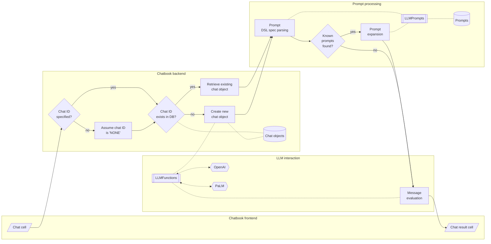

# JupyterChatbook

Python package of a Jupyter extension that facilitates the interaction with Large Language Models (LLMs).

**Remark:** The chatbook LLM cells use the packages 
["openai"](https://pypi.org/project/openai/), [OAIp2], 
and ["google-generativeai"](https://pypi.org/project/google-generativeai/), [GAIp1].

**Remark:** The API keys for the LLM cells are taken from the Operating System (OS) environmental variables `OPENAI_API_KEY` and `PALM_API_KEY`.

**Remark:** The results of the LLM cells are automatically copied to the clipboard
using the package ["pyperclip"](https://pypi.org/project/pyperclip/), [ASp1].

--------

## Installation

### Install from GitHub

```shell
pip install -e git+https://github.com/antononcube/Python-JupyterChatbook.git#egg=Python-JupyterChatbook
```

### From PyPi

```shell
pip install JupyterChatbook
```

-------

## Demonstration notebooks (chatbooks)

| Notebook                          | Description                                                                                 |
|-----------------------------------|---------------------------------------------------------------------------------------------|
| [Chatbooks-cells-demo.ipynb](https://github.com/antononcube/Python-JupyterChatbook/blob/main/docs/Chatbook-cells-demo.ipynb) | How to do [multi-cell (notebook-wide) chats](https://www.youtube.com/watch?v=8pv0QRGc7Rw)?  |
| [Chatbook-LLM-cells.ipynb](https://github.com/antononcube/Python-JupyterChatbook/blob/main/docs/Chatbook-LLM-cells.ipynb) | How to "directly message" LLMs services?                                                    |
| [DALL-E-cells-demo.ipynb](https://github.com/antononcube/Python-JupyterChatbook/blob/main/docs/DALL-E-cells-demo.ipynb)   | How to generate images with [DALL-E](https://openai.com/dall-e-2)?                          |
| [Echoed-chats.ipynb](https://github.com/antononcube/Python-JupyterChatbook/blob/main/docs/Echoed-chats.ipynb)             | How to see the LLM interaction execution steps?                                             |


-------

## Notebook-wide chats

Chatbooks have the ability to maintain LLM conversations over multiple notebook cells.
A chatbook can have more than one LLM conversations.
"Under the hood" each chatbook maintains a database of chat objects.
Chat cells are used to give messages to those chat objects.

For example, here is a chat cell with which a new 
["Email writer"](https://developers.generativeai.google/prompts/email-writer) 
chat object is made, and that new chat object has the identifier "em12":  

```
%%chat --chat_id em12, --prompt "Given a topic, write emails in a concise, professional manner"
Write a vacation email.
```

Here is a chat cell in which another message is given to the chat object with identifier "em12":

```
%%chat --chat_id em12
Rewrite with manager's name being Jane Doe, and start- and end dates being 8/20 and 9/5.
```

In this chat cell a new chat object is created:

```
%%chat -i snowman, --prompt "Pretend you are a friendly snowman. Stay in character for every response you give me. Keep your responses short."
Hi!
```

And here is a chat cell that sends another message to the "snowman" chat object:

```
%%chat -i snowman
Who build you? Where?
```

**Remark:** Specifying a chat object identifier is not required. I.e. only the magic spec `%%chat` can be used.
The "default" chat object ID identifier is "NONE".

For more examples see the notebook 
["Chatbook-cells-demo.ipynb"](https://github.com/antononcube/Python-JupyterChatbook/blob/main/docs/Chatbook-cells-demo.ipynb).

Here is a flowchart that summarizes the way chatbooks create and utilize LLM chat objects:



------

## Chat meta cells

***TBD...***

-------

## DALL-E access

***See the notebook ["DALL-E-cells-demo.ipynb"](https://github.com/antononcube/Python-JupyterChatbook/blob/main/docs/DALL-E-cells-demo.ipynb)***

Here is a screenshot:


-------

## Implementation details

The design of this package -- and corresponding envisioned workflows with it -- follow those of
the Raku package ["Jupyter::Chatbook"](https://github.com/antononcube/Raku-Jupyter-Chatbook), [AAp3].

-------

## TODO

- [ ] TODO Implementation
  - [X] DONE PalM chat cell
  - [ ] TODO Using ["pyperclip"](https://pypi.org/project/pyperclip/)
    - [X] DONE Basic
      - [X] `%%chatgpt`
      - [X] `%%dalle`
      - [X] `%%palm`
      - [X] `%%chat`
    - [ ] TODO Switching on/off copying to the clipboard
      - [X] DONE Per cell 
        - With the argument `--copy_to_clipboard`.
      - [ ] TODO Global 
        - Can be done via the chat meta cell, but maybe a more elegant, bureaucratic solution exists.
  - [X] DONE Formatted output: asis, html, markdown
      - General [lexer code](https://ipython.readthedocs.io/en/stable/api/generated/IPython.display.html#IPython.display.Code)?
        - Includes LaTeX.
      - [X] `%%chatgpt`
      - [X] `%%palm`
      - [X] `%%chat`
      - [ ] `%%chat_meta`?
  - [X] DONE DALL-E image variations cell
    - Combined image variations and edits with `%%dalle`.
  - [ ] TODO Mermaid-JS cell
  - [ ] TODO ProdGDT cell
  - [ ] MAYBE DeepL cell
    - See ["deepl-python"](https://github.com/DeepLcom/deepl-python)
  - [ ] TODO Lower level access to chat objects.
    - Like:
      - Getting the 3rd message
      - Removing messages after 2 second one
      - etc.
  - [ ] TODO Using LLM commands to manipulate chat objects
    - Like:
      - "Remove the messages after the second for chat profSynapse3."
      - "Show the third messages of each chat object." 
- [ ] TODO Documentation
  - [X] DONE Multi-cell LLM chats movie (teaser)
    - See [AAv2].
  - [ ] TODO LLM service cells movie (short)
  - [ ] TODO Multi-cell LLM chats movie (comprehensive)
  - [ ] TODO Code generation 

-------

## References

### Packages

[AAp1] Anton Antonov,
[LLMFunctionObjects Python package](https://github.com/antononcube/Python-packages/tree/main/LLMFunctionObjects),
(2023),
[Python-packages at GitHub/antononcube](https://github.com/antononcube/Python-packages).

[AAp2] Anton Antonov,
[LLMPrompts Python package](https://github.com/antononcube/Python-packages/tree/main/LLMPrompts),
(2023),
[Python-packages at GitHub/antononcube](https://github.com/antononcube/Python-packages).

[AAp3] Anton Antonov,
[Jupyter::Chatbook Raku package](https://github.com/antononcube/Raku-Jupyter-Chatbook),
(2023),
[GitHub/antononcube](https://github.com/antononcube).

[ASp1] Al Sweigart, 
[pyperclip (Python package)](https://pypi.org/project/pyperclip/),
(2013-2021),
[PyPI.org/AlSweigart](https://pypi.org/user/AlSweigart/).

[GAIp1] Google AI,
[google-generativeai (Google Generative AI Python Client)](https://pypi.org/project/google-generativeai/),
(2023),
[PyPI.org/google-ai](https://pypi.org/user/google-ai/).

[OAIp1] OpenAI, 
[openai (OpenAI Python Library)](https://pypi.org/project/openai/),
(2020-2023),
[PyPI.org](https://pypi.org/).

### Videos

[AAv1] Anton Antonov,
["Jupyter Chatbook multi cell LLM chats teaser (Raku)"](https://www.youtube.com/watch?v=wNpIGUAwZB8),
(2023),
[YouTube/@AAA4Prediction](https://www.youtube.com/@AAA4prediction).

[AAv2] Anton Antonov,
["Jupyter Chatbook multi cell LLM chats teaser (Python)"](https://www.youtube.com/watch?v=8pv0QRGc7Rw),
(2023),
[YouTube/@AAA4Prediction](https://www.youtube.com/@AAA4prediction).


